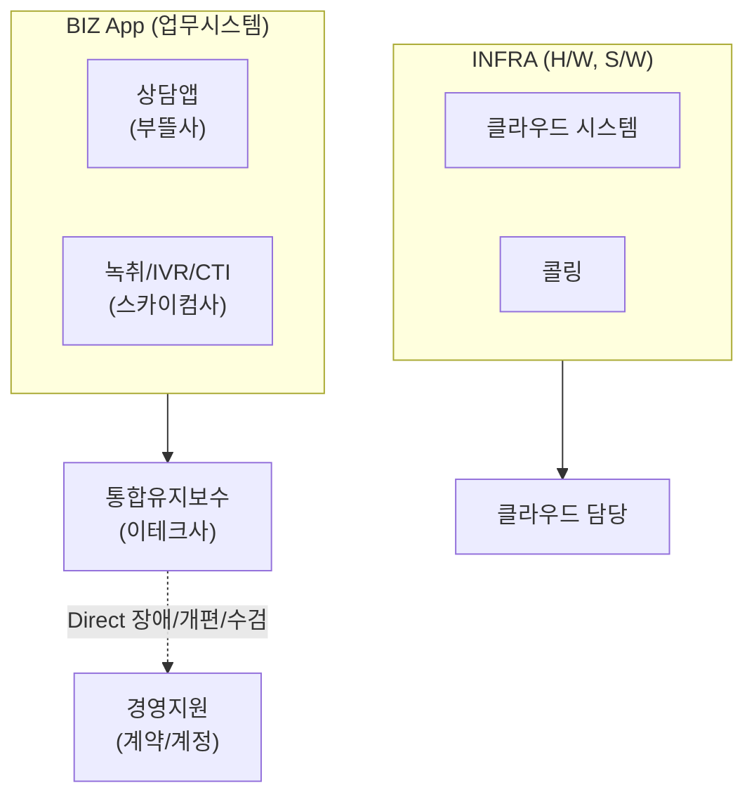

## 회의 시 추가 논의 예정 사항(26년4월30일)
- 직원 통화 녹음 기록 문제 : 노조협의사항 + AI진행상황 + 경영지원콜센터 
- ==단협 사항인 만큼 회사에서 키를 잡고 녹취 시스템을 추진을 하고, AX추진실에서는 여기서 만들어진 데이터를 가지고 AI를 적용하는 방향이 바람직하지 않나==

> [!과거 이슈 사항]
> 	-  21년 콜센터 재구축시 클라우드 콜센터로 전환 --> 경영은 콜센터 운영에서 빠지고 현업이 업무를 나눠서 하고 있는 구조(**어플리케이션 영역과 인프라(클라우드)영역으로 분리하여 업무영역 조정, 23년4월**)
> 	- 당시 클라우드 콜센터라 할지라도 경영에서 업무를 계속 했으면 좋겠다는 의견이었습니다. (당시 전략기획팀장 황일권)
> 	- 본부간 이견이 커서 당시 황선정 전무가 직접 업무 조정

> [!현재 이슈 사항]
> 	- 네트워크서비스부 : 교환기만 관리할 뿐,  직원 녹취는 경영정보와 이야기하자 --> ==**클라우드 서비스쪽과 우선 검토하자(심무경)**==
> 	- 경영정보 입장 : 관련된 정보가 없어 잘 모르지만, 정보를 주면 확인해 보겠다.
> 	- 담당업체(ECS시스템)통화 : 현재 교환기에 붙여 쓸 수 있는 솔루션이 있으며, 대화요약까지 가능

** 참고로 현재 콜센터 총괄 조직은 인증사업부 : 사용량이 가장 많아서 결정

## 업무 관계도

 
 ### 콜센터 BIZ App 및 INFRA 부문 부서별 업무책임 범위

|업무구분|BIZ App (업무시스템)|INFRA (클라우드시스템)|
|---|---|---|
|**① 사용자 관리**   사용자 계정 등록/폐기|경영지원부   (콜센터 요원/관리자 등록)|클라우드   (지정된 아키텍트만 접속 가능)|
|**② 계약 관리**   유지보수 및 개발용역|경영지원부|클라우드   (별도 계약 없이 사용료 청구)|
|**③ 수검 대응**   각종 보안감사·점검 등|관련부서   ※ 본인확인기관: 인증(총괄) → 관련부서 협조요청   ※ 취약점점검(콜센터 DB 및 서버): CISO → 클라우드|클라우드|
|**④ 작업 관리**   개편, QA/QC, 데이터 등|현업 → 이테크   (관련부서 공유)|현업 → 클라우드   (관련부서/이테크 공유)|
|**⑤ 장애 처리**   BIZ App / INFRA 장애|현업 → 이테크   (관련부서 공유)|클라우드 → 현업   (관련부서/이테크 공유)|
|**⑥ 출입 관리**   전산실 출입자 등록|(해당 없음)|클라우드|
|**⑦ 시스템 점검**   BIZ App / INFRA 시스템|현업|클라우드   (전사적 클라우드 점검 Level)|
|**⑧ 비용 정산**   이용률 기준|경영지원부 → 경영기획부|클라우드 → 경영기획부|

이 표를 보면 책임 구조에 몇 가지 패턴이 보입니다.

 ##과거 이력
 